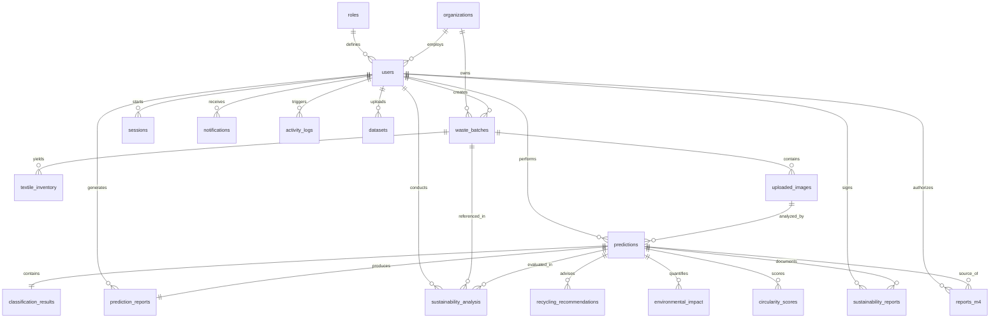

# Weave Cycle
> **AI-Powered Textile Waste Intelligence Platform**

Weave Cycle is a collaborative full-stack web application designed to track, sort, and optimize textile waste across manufacturers, recycling centers, and sustainability executives. This codebase covers all four milestones of the platform, establishing a modular, robust foundation for data cataloging, auditing, computer-vision based AI material classification, sustainability metrics tracking, and role-based executive reporting (PDF & Excel generation).

---

## 🏗️ Folder Structure

```text
weave-cycle/
├── docker-compose.yml       # Multi-container docker orchestrator
├── README.md                # System documentation
├── audit_report.md          # Reports Module audit findings & fixes
├── package.json             # Root configuration file
├── backend/                 # FastAPI Python backend
│   ├── requirements.txt     # Python libraries mapping
│   ├── Dockerfile           # Backend container build script
│   ├── ml_models/           # Saved neural network model files (.keras, .tflite, class names)
│   └── app/
│       ├── main.py          # Application entry point, router registrations & db auto-seeder
│       ├── config.py        # Environment settings parser
│       ├── auth/            # JWT token validation, hashing & security filters
│       ├── database/        # Session pooling, SQLite fallback, & engine configuration
│       ├── models/          # SQLAlchemy schemas (User, WasteBatch, Prediction, Report, Sustainability)
│       ├── schemas/         # Pydantic JSON input/output validation templates
│       ├── routes/          # REST endpoints (auth, users, inventory, datasets, dashboard, health, predictions)
│       ├── ai/              # ML inference services & model wrappers
│       ├── image_processing/# Preprocessing algorithms (edge detection, color dominance, quality control)
│       ├── material_classifier/ # Classification models, loaders, and preprocessing pipeline
│       ├── waste_classifier/ # Core waste batch classification algorithms
│       ├── predictions/     # Prediction DB interaction service layer
│       ├── sustainability/  # Sustainability dashboard service layer & route endpoints
│       ├── recommendations/ # Recycling pathway selection & recommendations routes
│       ├── environment/     # Ecological footprint & CO₂ equivalents computation routes
│       ├── circularity/     # Circularity index & lifecycle metrics calculation routes
│       ├── reports/         # PDF (ReportLab) & Excel (openpyxl) generation & Report Hub routes
│       └── utils/           # Shared utility tools
└── frontend/                # React Vite frontend
    ├── package.json         # Node packages mapping
    ├── tailwind.config.js   # Styling configuration (custom forest-charcoal & neon colors)
    ├── postcss.config.js    # PostCSS processing configuration
    ├── index.html           # HTML template & Font loader
    ├── Dockerfile           # Frontend container build script
    └── src/
        ├── main.jsx         # React bootstrapping
        ├── index.css        # Tailwind directives, neon glows, glassmorphic card classes
        ├── App.jsx          # Protected routing tree & layout wrapper
        ├── context/         # AuthContext JWT token provider & active user state
        ├── services/        # Axios API client config, endpoints service layer, 401 interceptors
        ├── layouts/         # collapsible DashboardLayout, custom Sidebar & Header notifications
        └── pages/           # Views:
            ├── LandingPage.jsx        # Landing page with platform overview
            ├── Login.jsx / Register.jsx # Authentication pages
            ├── DashboardHub.jsx       # Main dashboard with circular SVG Circularity ring
            ├── InventoryList.jsx      # Waste batch cataloging & stock tracking
            ├── BatchDetails.jsx       # Detailed trace timeline for single batch
            ├── DatasetModule.jsx      # Computer vision dataset training manager
            ├── UserManagement.jsx     # Admin page for managing role-based user access
            ├── ImageAnalysis/         # Upload-and-predict interface for neural network model
            ├── Predictions/           # Historical image predictions & detailed classification view
            ├── Sustainability/        # Sustainability metric breakdowns & report exports
            ├── Recommendations/       # Material recycling pathway action cards
            ├── Environment/           # CO₂ and water conservation equivalents
            ├── Circularity/           # Retention index and reuse potential breakdowns
            └── Reports/               # Reports Hub (Milestone 4 PDF/Excel generation page)
```

---

## 🛠️ Technology Stack

| Layer | Technologies | Description |
| :--- | :--- | :--- |
| **Frontend** | React (Vite), Tailwind CSS, React Router, React Hook Form, Axios, Lucide Icons, Recharts | Glassmorphism UI, interactive charts (Radar, Bar, Pie), and custom SVG sparklines |
| **Backend** | Python, FastAPI, SQLAlchemy, JWT Authentication, Pydantic, Pillow, NumPy | High-performance async API server with SQLite / PostgreSQL dual-dialect support |
| **ML Inference** | TensorFlow, Keras, TensorFlow Lite | Image analysis and multi-class fabric composition classification |
| **Reporting & Export**| ReportLab, openpyxl | Multi-sheet branded Excel workbooks and styled PDF exports |
| **Database** | PostgreSQL / SQLite | Session pooling and relational storage |
| **Containers** | Docker, Docker Compose | Multi-container orchestration |

---

## 🔒 User Roles & Access Matrix

Weave Cycle implements Role-Based Access Control (RBAC) across four roles:
1. **Administrator**: Manages system users, checks database connections, and views global logs.
2. **Sustainability Manager**: Accesses CO₂ emissions offsets, water savings indices, and registers ML training sets.
3. **Recycling Facility Operator**: Manages warehouse stock, changes batch sorting tags, and updates bin locations.
4. **Textile Manufacturer**: Dispatches factory scrap batches and monitors available recycled materials.

### Feature Access Matrix

| Feature | Administrator | Sustainability Manager | Recycling Operator | Textile Manufacturer |
| :--- | :---: | :---: | :---: | :---: |
| **User Management** | ✅ Yes | ❌ No | ❌ No | ❌ No |
| **System Logs** | ✅ Yes | ❌ No | ❌ No | ❌ No |
| **Register Datasets** | ✅ Yes | ✅ Yes | ❌ No | ❌ No |
| **Log Waste Batches** | ❌ No | ❌ No | ✅ Yes | ✅ Yes |
| **Update Batch Status** | ❌ No | ❌ No | ✅ Yes | ❌ No |
| **AI Classification Upload** | ✅ Yes | ✅ Yes | ✅ Yes | ✅ Yes |
| **Sustainability Metrics** | ✅ Yes | ✅ Yes | ❌ No | ❌ No |
| **Generate Report Hub Reports**| ✅ Yes | ✅ Yes | ✅ Yes | ✅ Yes |
| **Export/Download PDF & Excel**| ✅ Yes | ✅ Yes | ✅ Yes | ✅ Yes |

---

## 🛢️ Database Schema & ER Diagram



### Table Definitions:
* **roles**: System RBAC configurations.
* **organizations**: Registered corporations (Manufacturers, Recyclers).
* **users**: User credentials, contact data, profile links.
* **sessions**: Active refresh tokens to handle remember-me logins.
* **notifications**: Active alerts shown in the top notification slide.
* **activity_logs**: Security-compliant audit trails of logins, CRUD operations, and updates.
* **datasets**: Archive registries for computer vision (DeepFashion, Fashion-MNIST, etc.).
* **waste_batches**: Detailed tracking of waste scraps (Weight, Composition, Location, Status).
* **textile_inventory**: Resulting stock quantities yielded from sorted waste.
* **uploaded_images**: Uploaded textile images metadata, color info, texture analysis, and damage detection flags.
* **predictions**: Core classification results containing material/waste categories and confidence scores.
* **classification_results**: Deep breakdowns containing material probabilities, fiber compositions, and recovery indicators.
* **prediction_reports**: Metadata for AI classification summaries.
* **sustainability_analysis**: Sustainability indices, longevity scores, and textual AI insights.
* **recycling_recommendations**: Recommended recycling pathways, required processing, costs, and timeline estimates.
* **environmental_impact**: Quantified ecological savings (CO₂ saved, water saved, trees equivalent).
* **circularity_scores**: Circularity index, reuse potential, retention, and rating classifications.
* **sustainability_reports**: Printable PDF/Excel report records containing executive summaries.
* **reports_m4 (Report)**: Assembled JSON report data, status, and download links for the Milestone 4 Report Hub.

---

## 📡 REST API Reference

### 1. Authentication
* `POST /api/v1/auth/login`: Authenticate user credentials and return JWT bearer token.
* `POST /api/v1/auth/register`: Create a new user profile.
* `POST /api/v1/auth/refresh`: Refresh expired credentials using cookie/body tokens.
* `POST /api/v1/auth/logout`: Revoke active session tokens.

### 2. Waste & Inventory Management
* `GET /api/v1/inventory`: Retrieve logged waste batches (filtered by organization/creator).
* `POST /api/v1/inventory`: Log a new textile waste batch.
* `GET /api/v1/inventory/batches/{id}`: Detailed trace history and composition of a specific batch.
* `PUT /api/v1/inventory/batches/{id}`: Update location, status, or sorting details.
* `DELETE /api/v1/inventory/batches/{id}`: Delete a batch from active tracking.

### 3. AI Prediction Pipeline
* `POST /api/v1/predictions/predict`: Upload image file, execute ML classification models, extract colors/textures, assess damage/contamination, and save prediction.
* `GET /api/v1/predictions/history`: Fetch list of historical predictions.
* `GET /api/v1/predictions/{id}`: Retrieve full classification results and confidence rates.

### 4. Sustainability & Circular Intelligence
* `POST /api/v1/sustainability/analyze`: Run sustainability analysis (longevity, insights) on a prediction batch.
* `POST /api/v1/recommendations/generate`: Build custom recycling pathways and techniques.
* `POST /api/v1/environment/assess`: Quantify CO₂ / water / energy savings and ecological equivalents.
* `POST /api/v1/circularity/calculate`: Calculate circularity retention indexes and reuse ratings.

### 5. Report Hub & Export (Milestone 4)
* `POST /api/v1/report-hub/generate`: Assembles dynamic JSON data and saves a master report record.
* `GET /api/v1/report-hub/history` (or `/history`): Retrieves paginated, sorted, and filtered generated reports.
* `GET /api/v1/report-hub/types`: Returns the list of report types permitted by the current user's role.
* `GET /api/v1/report-hub/{id}`: Fetch detailed data payload of a generated report.
* `GET /api/v1/report-hub/export/pdf/{id}`: Stream and download a styled PDF report.
* `GET /api/v1/report-hub/export/excel/{id}`: Stream and download a branded, multi-sheet Excel workbook.
* `DELETE /api/v1/report-hub/{id}`: Archive or delete a report.

---

## 🚀 Getting Started

You can run the application either locally on your host machine or containerized in Docker.

### Option A: Local Host Development (Recommended)

#### 1. Start the PostgreSQL Server
Ensure PostgreSQL is active on port `5432`. Create a database named `weavecycle` if necessary (our backend automatically attempts to auto-create the database on start). Alternatively, if no Postgres is available, the backend automatically falls back to SQLite (`weavecycle.db` file in the backend root).

#### 2. Run the Backend API
```bash
cd backend
# Create and activate virtual environment
python -m venv venv
.\venv\Scripts\activate   # On Windows
source venv/bin/activate  # On macOS/Linux

# Install dependencies
pip install -r requirements.txt

# Start the uvicorn development server
uvicorn app.main:app --reload --port 8000
```
* The Swagger API documentation will be available at [http://localhost:8000/docs](http://localhost:8000/docs) (or [http://localhost:8000/api/v1/docs](http://localhost:8000/api/v1/docs) when prefixing)

#### 3. Run the Frontend App
```bash
cd frontend
# Install package dependencies
npm install

# Run development server
npm run dev
```
* Open your browser to [http://localhost:5173](http://localhost:5173)

---

### Option B: Docker Compose Containerization

Ensure Docker and Docker Compose are installed on your system. Run:
```bash
docker compose up --build
```
* Docker Compose exposes the PostgreSQL database on port `5433` (to prevent conflicts with any local database running on 5432).
* API: [http://localhost:8000](http://localhost:8000)
* Web Portal: [http://localhost:5173](http://localhost:5173)

---

## 🔐 Default Credentials for Testing

Default users are automatically seeded into the database on startup:

| Role | Email / Username | Password |
| :--- | :--- | :--- |
| **Administrator** | `admin@weavecycle.com` | `AdminPass123!` |
| **Sustainability Manager** | `manager@weavecycle.com` | `ManagerPass123!` |
| **Recycling Operator** | `operator@weavecycle.com` | `OperatorPass123!` |
| **Textile Manufacturer** | `manufacturer@weavecycle.com` | `ManufacturerPass123!` |
