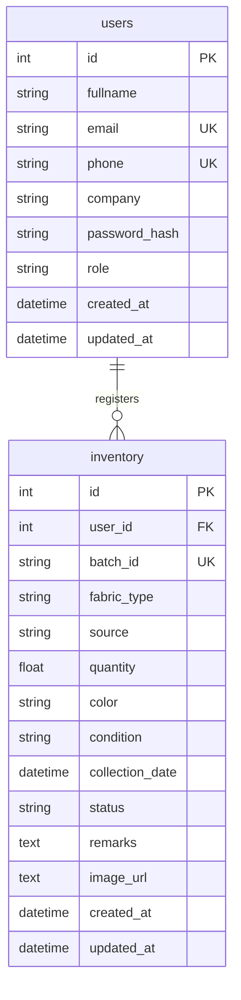

# System Architecture Document

This document outlines the architecture, database schema, role-based permissions, and data flows of the **AI Textile Waste Intelligence Platform**.

---

## Technology Stack
- **Frontend**: React (Vite), TailwindCSS, React Router, Axios, Recharts (Chart.js wrapper).
- **Backend**: FastAPI, SQLAlchemy (ORM), JWT authentication (HS256).
- **Database**: PostgreSQL (production), SQLite (local fallback/development).

---

## Database Schema

---

## Role-Based Access Control (RBAC)

1. **Administrator**:
   - **Access**: Admin Dashboard, User Management, Global Inventory.
   - **Operations**: Create, read, edit, suspend/delete user profiles; delete any inventory record.
2. **Textile Manufacturer**:
   - **Access**: User Dashboard, My Inventory.
   - **Operations**: Create, edit, and delete own inventory batches.
3. **Recycling Facility Operator**:
   - **Access**: User Dashboard, My Inventory.
   - **Operations**: Read-only access to details; can ONLY update the `status` (`processingStatus`) of assigned batches to track recycling progress.
4. **Sustainability Manager**:
   - **Access**: Read-only global statistics and inventory listings.
   - **Operations**: Strictly view-only. No CRUD allowed.
